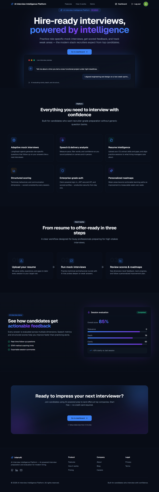
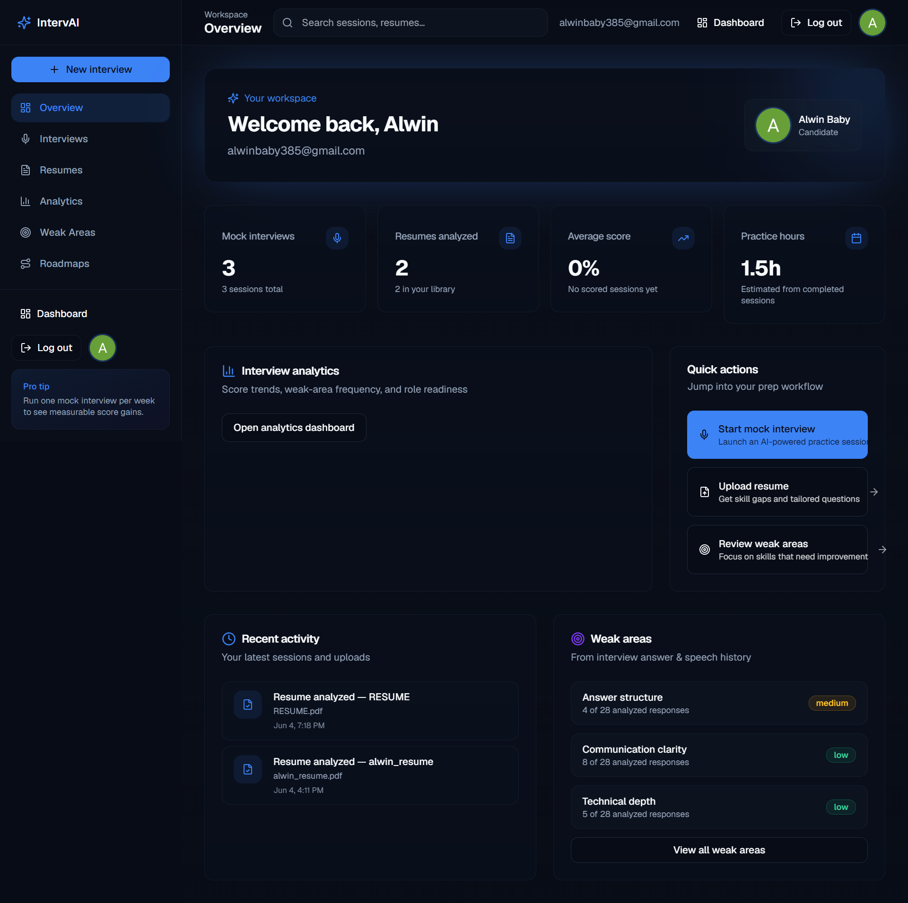
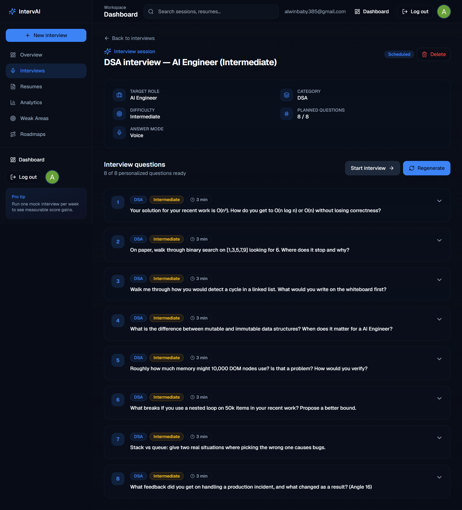
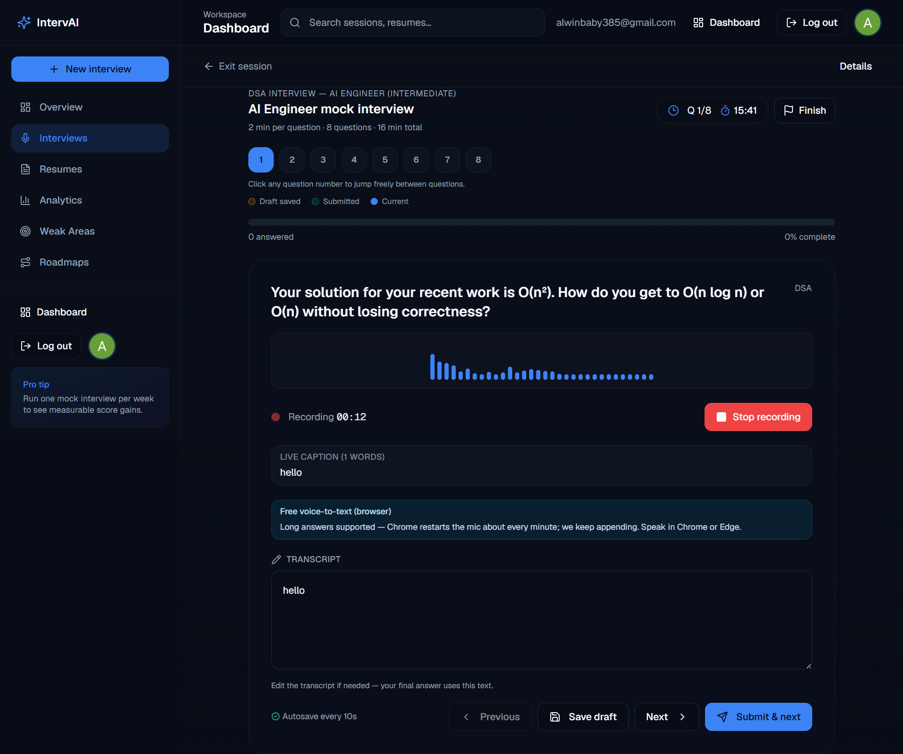
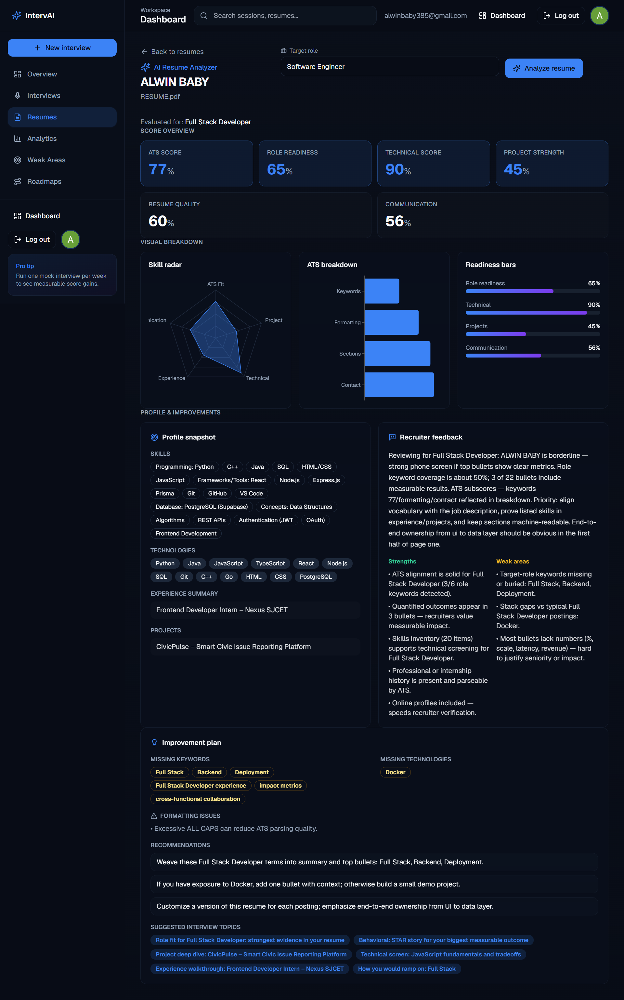
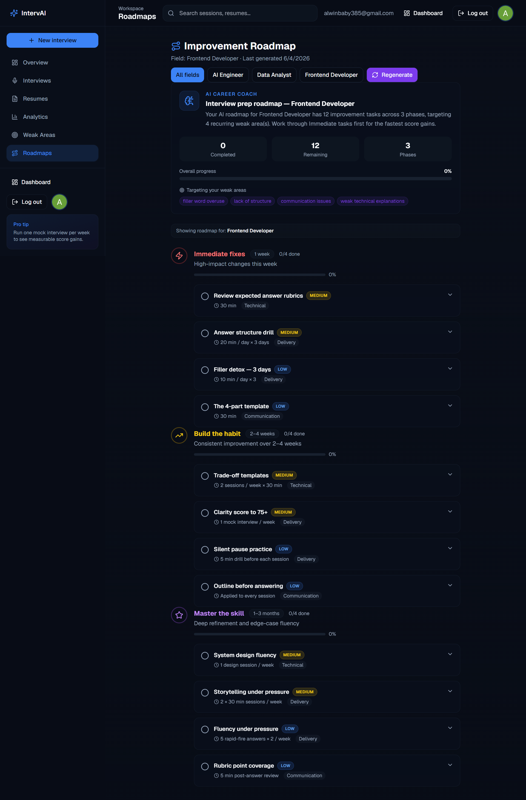
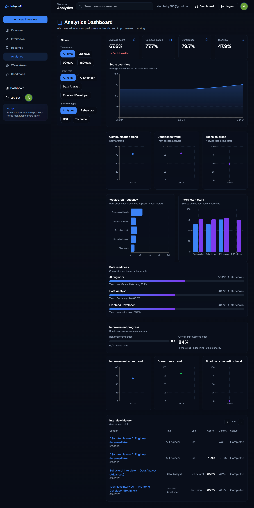

<div align="center">

# IntervAI

### AI Interview Intelligence Platform

Practice role-specific mock interviews, get scored feedback, analyze your resume, and track weak areas — built for candidates who want recruiter-grade preparation.

<br />

[](https://interv-ai-zeta.vercel.app/)
[](https://intervai-3ycg.onrender.com/api/v1/health)
[](https://github.com/Alwin-385/IntervAI/actions/workflows/ci.yml)
[]()

[Live Demo](https://interv-ai-zeta.vercel.app/) · [API Health](https://intervai-3ycg.onrender.com/api/v1/health) · [Report Bug](https://github.com/Alwin-385/IntervAI/issues)

</div>

---

## Live deployment

| Service | Platform | URL |
|---------|----------|-----|
| **Frontend** | [Vercel](https://vercel.com) | [**https://interv-ai-zeta.vercel.app**](https://interv-ai-zeta.vercel.app/) |
| **Backend API** | [Render](https://render.com) | [**https://intervai-3ycg.onrender.com**](https://intervai-3ycg.onrender.com) |
| **Health check** | — | [https://intervai-3ycg.onrender.com/api/v1/health](https://intervai-3ycg.onrender.com/api/v1/health) |
| **Source code** | GitHub | [github.com/Alwin-385/IntervAI](https://github.com/Alwin-385/IntervAI) |

> **Note:** The Render free tier may sleep when idle. The first request after a while can take 30–60 seconds while the API wakes up. Refresh the app if you see a connection error.

---

## Screenshots

<p align="center">
  
  <br />
  <em>Landing page — AI-native interview preparation</em>
</p>

<table>
<tr>
<td width="50%" align="center">
  
  <br />
  <sub><b>Dashboard</b> — stats, activity, quick actions</sub>
</td>
<td width="50%" align="center">
  
  <br />
  <sub><b>Interview questions</b> — role-tailored AI generation</sub>
</td>
</tr>
<tr>
<td width="50%" align="center">
  
  <br />
  <sub><b>Mock interview</b> — voice answers & live captions</sub>
</td>
<td width="50%" align="center">
  
  <br />
  <sub><b>Resume analysis</b> — rubric scores & feedback</sub>
</td>
</tr>
<tr>
<td width="50%" align="center">
  
  <br />
  <sub><b>Roadmap</b> — personalized prep plan</sub>
</td>
<td width="50%" align="center">
  
  <br />
  <sub><b>Analytics</b> — progress & weak areas</sub>
</td>
</tr>
</table>

> **Add your images:** Save screenshots as PNG files in [`docs/images/`](./docs/images/) using the filenames above. See [`docs/images/README.md`](./docs/images/README.md) for capture steps.

**[→ Try the live app](https://interv-ai-zeta.vercel.app/)**

---

## Features

| Feature | Description |
|---------|-------------|
| **Adaptive mock interviews** | LangGraph-powered question generation tailored to role, difficulty, resume, and weak areas |
| **Voice answers** | Browser speech-to-text + audio upload; practice like a real video interview |
| **Resume intelligence** | PDF upload, extraction, rubric-based scoring, and skill-gap insights |
| **Structured evaluation** | Technical, behavioral, and communication scores with session summaries |
| **Weak-area tracking** | Detect recurring gaps from answers and speech; feed into future questions |
| **Personalized roadmaps** | AI improvement plans from your interview history |
| **Analytics dashboard** | Progress trends, readiness scores, and activity overview |
| **Secure auth** | [Clerk](https://clerk.com) sign-in with JWT-verified API access |

---

## Tech stack

<table>
<tr>
<td width="50%" valign="top">

**Frontend**

- Next.js 15 · React 19 · TypeScript  
- Tailwind CSS · shadcn/ui  
- TanStack Query · Zustand  
- Framer Motion · Recharts  
- Clerk authentication  

</td>
<td width="50%" valign="top">

**Backend**

- FastAPI · Python 3.12  
- SQLAlchemy 2.0 · Alembic  
- PostgreSQL ([Supabase](https://supabase.com))  
- LangGraph orchestration  
- S3-compatible storage (Supabase)  
- Heuristic AI mode (no OpenAI key required)  

</td>
</tr>
</table>

**Infrastructure (production)**

```
┌─────────────────┐     HTTPS      ┌──────────────────┐
│  Vercel         │ ──────────────▶│  Render          │
│  Next.js app    │   REST + JWT   │  FastAPI API     │
└─────────────────┘                └────────┬─────────┘
                                            │
                    ┌───────────────────────┼───────────────────────┐
                    ▼                       ▼                       ▼
             ┌────────────┐          ┌────────────┐          ┌────────────┐
             │  Supabase  │          │   Clerk    │          │  Supabase  │
             │  Postgres  │          │   Auth     │          │  Storage   │
             └────────────┘          └────────────┘          └────────────┘
```

---

## Local development

### Prerequisites

- Node.js 20+  
- Python 3.12+  
- PostgreSQL (or Docker Compose for infra)  
- [Clerk](https://dashboard.clerk.com) dev keys  

### Quick start

```powershell
# 1. Clone
git clone https://github.com/Alwin-385/IntervAI.git
cd IntervAI

# 2. Environment
copy backend\.env.example backend\.env
copy frontend\.env.example frontend\.env.local
# Fill in Clerk keys, DATABASE_URL, etc.

# 3. Start infra (Postgres, Redis, Qdrant) — optional for full stack
.\scripts\start-dev.ps1

# 4. Backend (terminal 1)
.\scripts\start-backend.ps1

# 5. Frontend (terminal 2)
.\scripts\start-frontend.ps1
```

| Service | URL |
|---------|-----|
| Frontend | http://localhost:3000 |
| Backend API | http://localhost:8000 |
| API docs | http://localhost:8000/docs |
| Health | http://localhost:8000/api/v1/health |

See **[docs/TESTING.md](docs/TESTING.md)** for phase-by-phase testing checklists.

---

## Project structure

```
IntervAI/
├── frontend/          # Next.js 15 application (Vercel)
├── backend/           # FastAPI API (Render)
├── docker/            # Dockerfiles for local dev
├── docs/              # Auth, resumes, testing guides
├── scripts/           # PowerShell dev helpers
└── .github/workflows/ # CI (lint + tests)
```

---

## API overview

Base URL (production): `https://intervai-3ycg.onrender.com`

| Endpoint | Description |
|----------|-------------|
| `GET /api/v1/health` | Service health |
| `GET /api/v1/me` | Current user (Clerk JWT) |
| `POST /api/v1/resumes/upload` | Upload resume PDF |
| `POST /api/v1/interviews/create` | Create interview session |
| `POST /api/v1/interviews/{id}/generate-questions` | Generate questions |
| `POST /api/v1/roadmap/generate` | Generate improvement roadmap |
| `GET /api/v1/dashboard/overview` | Dashboard stats |

Full interactive docs: `http://localhost:8000/docs` (local) or deploy Swagger on your API host.

---

## Testing & quality

```powershell
# Backend
cd backend
.\.venv\Scripts\pytest -m unit -q
.\.venv\Scripts\ruff.exe check app
.\.venv\Scripts\ruff.exe format --check app

# Frontend
cd frontend
npm test
npm run lint
npm run format:check
```

GitHub Actions runs lint and tests on every push to `main`.

---

## Deployment summary

This project uses a **free-tier** production stack:

| Layer | Service | Notes |
|-------|---------|-------|
| Frontend | Vercel Hobby | Root dir: `frontend` |
| Backend | Render Free Web Service | Root dir: `backend`, Gunicorn + Uvicorn |
| Database | Supabase PostgreSQL | Session pooler URL |
| File storage | Supabase Storage | S3-compatible API |
| Auth | Clerk | Test keys for development |

Key backend env vars for production:

- `BACKGROUND_JOBS_MODE=thread` (no separate Celery worker on free tier)  
- `INTERVIEW_QUESTIONS_HEURISTIC_ONLY=true`  
- `CORS_ORIGINS=https://interv-ai-zeta.vercel.app`  

Templates: `backend/.env.production.example`, `frontend/.env.production.example`

---

## Documentation

| Doc | Topic |
|-----|-------|
| [docs/TESTING.md](docs/TESTING.md) | Local testing by phase |
| [docs/auth.md](docs/auth.md) | Clerk setup |
| [docs/resumes.md](docs/resumes.md) | Resume upload & extraction |
| [docs/resume-analysis.md](docs/resume-analysis.md) | AI resume analyzer |

---

## Author

**Alwin** — [GitHub @Alwin-385](https://github.com/Alwin-385)

Built as a full-stack AI interview preparation platform with production deployment on Vercel + Render + Supabase.

---

<div align="center">

**[interv-ai-zeta.vercel.app](https://interv-ai-zeta.vercel.app/)** · Practice smarter. Interview with confidence.

</div>
